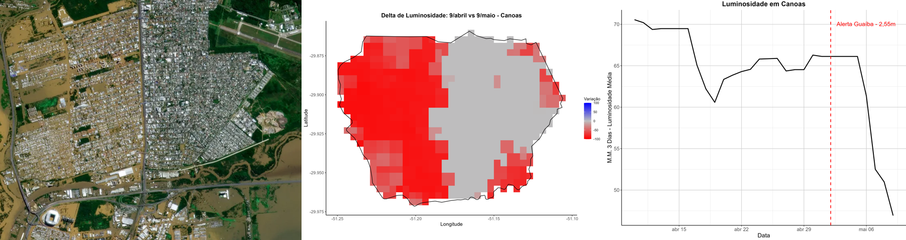

## Luminosidade Noturna no RS

Este repositório contém a análise da evolução da luminosidade noturna no Rio Grande do Sul pós enchentes. Utilizando o produto VNP46A2 do Black Marble da Nasa (Román et al., 2018), as análises focam na variação de luminosidade noturna entre os dias de 9 de abril a 9 de maio do ano 2024 para o estado do Rio Grande do Sul, municípios de Porto Alegre e Canoas.

À esquerda, foto de satélite de Canoas após enchentes. À direita, variação da luminosidade noturna.

Este projeto é relevante por conseguir analisar todos os municípios do estado caso necessário, não só a região metropolitana.

### Estrutura do Projeto
- **scripts/**: Diretório contendo os scripts usados no projeto.
  - `create_tiles.py`: Script que junta os arquivos TIFF em um tile único para cada dia.
  - `delta.R`: Script que calcula e plota a variação de luminosidade.
  - `timeline.R`: Script que calcula e plota as séries de tempo de luminosidade.
- **grafico/**: Diretório contendo os resultados das análises.
  - **delta/**: Plots da variação de luminosidade.
    - `delta_RS.png`
    - `delta_PortoAlegre.png`
    - `delta_Canoas.png`
  - **timeline/**: Plots das séries de tempo de luminosidade.
    - `timeline_RS.png`
    - `timeline_PortoAlegre.png`
    - `timeline_Canoas.png`
- **README.md**: Este arquivo.

### Dados
Os arquivos TIFF que abrangem o Rio Grande do Sul estão nas coordenadas h12v11, h12v12, h13v11. Você pode baixá-los no [site da nasa](https://ladsweb.modaps.eosdis.nasa.gov/archive/allData/5000/VNP46A2) e compilá-los com o código python ou então os tiles já comprimidos no [meu drive](https://drive.google.com/drive/folders/1uvZCc3xIDAUm0k-ojy7hohBbxhua8_JU?usp=drive_link). Você também precisa do shapefile  da malha municipal. Baixe aqui no [IBGE](https://www.ibge.gov.br/geociencias/organizacao-do-territorio/malhas-territoriais/15774-malhas.html)

## Requisitos
- Python 3.x
- R

### Referências
Román, M. O., Wang, Z., Sun, Q., Kalb, V., Miller, S. D., Molthan, A., ... & Masuoka, E. J. (2018). NASA's Black Marble nighttime lights product suite. Remote Sensing of Environment, 210, 113-143.
